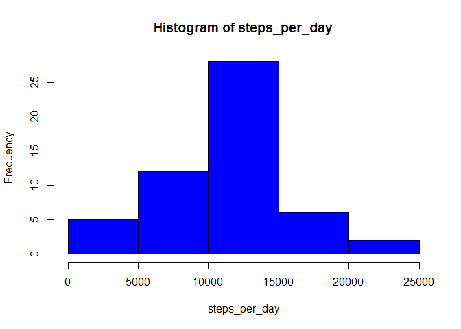
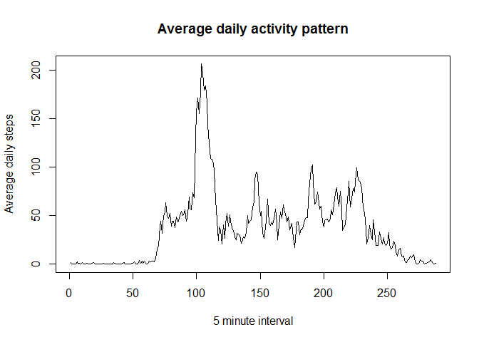

# Reproducible Research: Peer Assessment 1


## Loading and preprocessing the data

```r
data <- read.csv("activity.csv")
```


## What is mean total number of steps taken per day?

### Total number of steps per day

```r
aggregate(data$steps, by=data["date"], sum, na.rm=T)
```

```
##          date     x
## 1  2012-10-01     0
## 2  2012-10-02   126
## 3  2012-10-03 11352
## 4  2012-10-04 12116
## 5  2012-10-05 13294
## 6  2012-10-06 15420
## 7  2012-10-07 11015
## 8  2012-10-08     0
## 9  2012-10-09 12811
## 10 2012-10-10  9900
## 11 2012-10-11 10304
## 12 2012-10-12 17382
## 13 2012-10-13 12426
## 14 2012-10-14 15098
## 15 2012-10-15 10139
## 16 2012-10-16 15084
## 17 2012-10-17 13452
## 18 2012-10-18 10056
## 19 2012-10-19 11829
## 20 2012-10-20 10395
## 21 2012-10-21  8821
## 22 2012-10-22 13460
## 23 2012-10-23  8918
## 24 2012-10-24  8355
## 25 2012-10-25  2492
## 26 2012-10-26  6778
## 27 2012-10-27 10119
## 28 2012-10-28 11458
## 29 2012-10-29  5018
## 30 2012-10-30  9819
## 31 2012-10-31 15414
## 32 2012-11-01     0
## 33 2012-11-02 10600
## 34 2012-11-03 10571
## 35 2012-11-04     0
## 36 2012-11-05 10439
## 37 2012-11-06  8334
## 38 2012-11-07 12883
## 39 2012-11-08  3219
## 40 2012-11-09     0
## 41 2012-11-10     0
## 42 2012-11-11 12608
## 43 2012-11-12 10765
## 44 2012-11-13  7336
## 45 2012-11-14     0
## 46 2012-11-15    41
## 47 2012-11-16  5441
## 48 2012-11-17 14339
## 49 2012-11-18 15110
## 50 2012-11-19  8841
## 51 2012-11-20  4472
## 52 2012-11-21 12787
## 53 2012-11-22 20427
## 54 2012-11-23 21194
## 55 2012-11-24 14478
## 56 2012-11-25 11834
## 57 2012-11-26 11162
## 58 2012-11-27 13646
## 59 2012-11-28 10183
## 60 2012-11-29  7047
## 61 2012-11-30     0
```


### Histogram of total number of steps per day

```r
steps_per_day <- tapply(data$steps,data$date,sum)
hist(steps_per_day, col="blue")
```

 


### Summary of total number of steps per day

```r
steps_summary <- summary(steps_per_day)
steps_summary
```

```
##    Min. 1st Qu.  Median    Mean 3rd Qu.    Max.    NA's 
##      41    8841   10760   10770   13290   21190       8
```


The mean and median of the total number of steps per day is 1.077\times 10^{4} and 1.076\times 10^{4} respectively.


## What is the average daily activity pattern?


### Plot of average daily activity

```r
avg_daily_steps <- tapply(data$steps,data$interval,mean,na.rm=T)
plot(avg_daily_steps, type="l", ylab="Average daily steps", xlab="5 minute interval", main="Average daily activity pattern")
```

 


### Interval with max average steps

```r
max_steps <- max(avg_daily_steps)
interval_max <- names(avg_daily_steps[which(avg_daily_steps == max_steps)])
```

835th interval has the maximum number of aaverage steps taken across all the days is the dataset with value of 206.1698113 steps.


## Imputing missing values


## Are there differences in activity patterns between weekdays and weekends?
